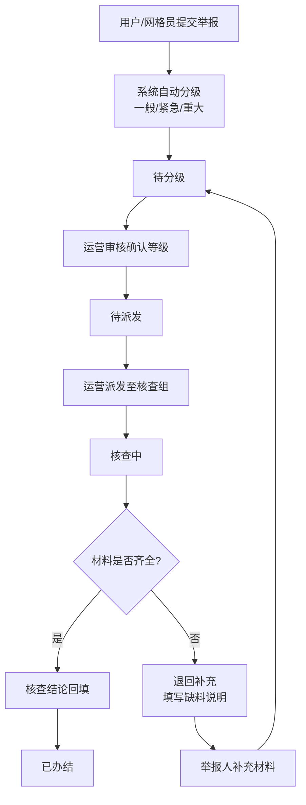

## 1. 产品概述

面向618等大促期间乱跳转等违规行为举报的全流程线索管理平台，覆盖线索提交、智能分级、运营派发、核查处理、办结回流的完整业务链路，同时提供积压预警与核查效能统计。

- 解决问题：大促期间举报线索爆发式涌入，人工处理效率低、分级派单混乱、流程不可追溯
- 目标用户：普通举报用户、基层网格员、运营管理人员、各核查组
- 产品价值：标准化线索生命周期管理，提升处理效率，保障大促期间违规响应时效

## 2. 核心功能

### 2.1 用户角色

| 角色 | 说明 | 核心权限 |
|------|------|----------|
| 举报用户 | 普通消费者 | 提交举报线索、查看本人举报进度 |
| 网格员 | 基层巡查人员 | 提交举报线索、上传现场素材、查看本人提交线索 |
| 运营人员 | 平台运营管理人员 | 线索分级、筛选、认领、派发至核查组、退回补充、查看积压与统计 |
| 核查组 | 各业务核查团队 | 接收派发线索、执行核查、回填结论与附件、标记办结 |

### 2.2 功能模块

1. **首页/仪表盘**：线索积压概览、我的经手线索、核查组效能排行
2. **举报提交**：填写被举报应用、违规表现、发生时间、联系方式、证据附件
3. **线索工作台（运营）**：分级筛选列表、批量认领、派发、退回补充操作
4. **核查工作台（核查组）**：待核查列表、详情查看、结论回填、办结提交
5. **统计报表**：各核查组办结量、平均处理时长、分级占比趋势

### 2.3 页面详情

| 页面名称 | 模块名称 | 功能描述 |
|----------|----------|----------|
| 首页仪表盘 | 积压概览卡片 | 按三级（一般/紧急/重大）显示待处理线索数量与积压时长预警 |
| 首页仪表盘 | 我的经手列表 | 当前登录用户提交/认领/派发/核查的所有线索，支持状态筛选 |
| 首页仪表盘 | 核查效能排行 | 各核查组办结量条形图、平均处理时长对比 |
| 举报提交 | 表单模块 | 被举报应用（下拉/搜索）、违规类型、详细描述、发生时间、联系方式、证据上传、举报人类型（用户/网格员） |
| 线索工作台 | 筛选工具栏 | 按等级、状态、提交时间范围、被举报应用、核查组筛选 |
| 线索工作台 | 线索列表 | 卡片/表格切换，显示等级标签、状态标签、应用名、违规摘要、提交时间、当前处理人 |
| 线索工作台 | 详情抽屉 | 完整线索详情、操作历史时间线、认领/派发/退回操作表单 |
| 核查工作台 | 待办列表 | 派发至本组的待核查线索，按紧急程度排序 |
| 核查工作台 | 结论回填 | 核查结论（属实/不属实/需进一步核实）、处理建议、附件、办结/退回操作 |
| 统计报表 | 办结量排行 | 按月/周维度的各核查组办结数量柱状图 |
| 统计报表 | 处理时长分析 | 各组平均处理时长折线图、SLA达标率 |

## 3. 核心流程

举报用户或网格员填写举报表单提交，系统根据违规严重程度和涉及面自动分级（一般/紧急/重大），线索进入"待分级"状态。运营人员在线索工作台审核分级后，将状态流转为"待派发"并认领或直接派发给对应核查组。核查组接收后状态变为"核查中"，核查完成后回填结论，标记"已办结"；若材料不足则"退回补充"，举报人补充后重新进入待分级。

## 4. 用户界面设计

### 4.1 设计风格

- 主色调：深海军蓝 `#0F2747` 搭配警示橙 `#FF6B35`（紧急标识），翡翠绿 `#10B981`（一般）、琥珀红 `#EF4444`（重大）
- 中性色：石板灰系列，分层卡片使用柔和阴影与圆角
- 按钮风格：主按钮实色填充+圆角8px，次按钮描边+悬浮实色过渡
- 字体：标题使用 "Noto Serif SC" 衬线体提升专业感，正文使用 "PingFang SC" 保障可读性
- 布局：左侧固定导航 + 顶部状态栏 + 主内容区卡片网格，运营工作台采用密排表格布局
- 图标：线性图标（Lucide），重大等级配脉冲红圈动画
- 状态标签：带渐变背景的胶囊标签，含动画过渡

### 4.2 页面设计概览

| 页面名称 | 模块名称 | UI元素 |
|----------|----------|--------|
| 首页仪表盘 | 积压概览卡片 | 三色分级卡片、数字跳动动画、积压进度条、悬浮高亮 |
| 首页仪表盘 | 我的经手列表 | 行级淡入、状态胶囊、时间线标记 |
| 举报提交 | 表单模块 | 分组折叠面板、非法输入震动反馈、附件拖拽区、提交成功粒子动画 |
| 线索工作台 | 筛选工具栏 | 下拉多选器、日期范围选择器、等级快速切换tab |
| 线索工作台 | 线索列表 | 紧急行高亮底色、行悬浮展开摘要、批量选择复选框 |
| 线索工作台 | 详情抽屉 | 右侧滑入、操作时间线纵向轨道、派发选择器带搜索 |
| 核查工作台 | 待办列表 | 优先级角标、截止倒计时、逾期红色脉冲 |
| 统计报表 | 图表区 | 柱状图渐变色填充、折线图节点悬浮tooltip、排行动态渲染 |

### 4.3 响应式

桌面端优先（1440px），侧边栏240px固定；1024px以下侧边栏折叠为图标；移动端适配为底部Tab导航+卡片单列布局，表格转为卡片堆叠。
