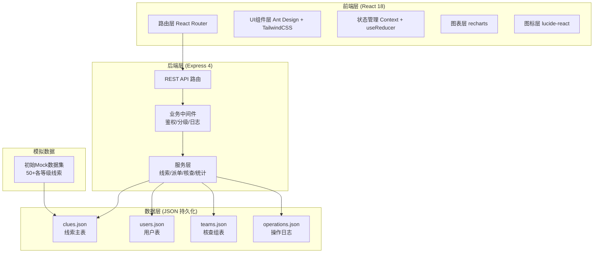
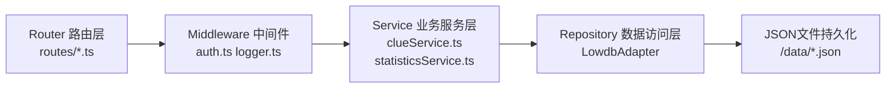
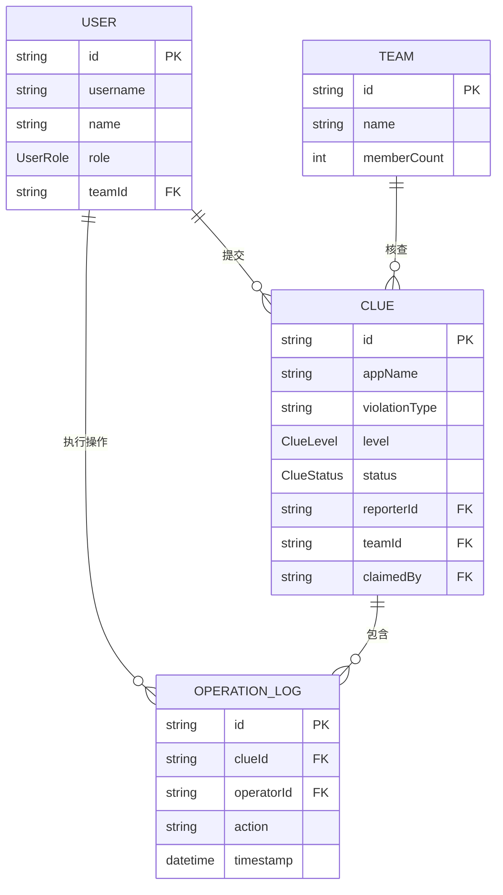

## 1. 架构设计



## 2. 技术描述

- 前端：React@18.2 + Vite@5 + TypeScript@5 + Ant Design@5 + TailwindCSS@3 + React Router@6 + recharts@2 + lucide-react@0.344
- 后端：Express@4 + cors + body-parser + lowdb（JSON文件持久化）
- 构建工具：Vite 初始化 React + TS 模板
- 数据存储：JSON 文件数据库（lowdb），无需独立数据库，开箱即用
- 鉴权：前端模拟角色切换（localStorage 持久化登录态），后端中间件读取 Header 角色信息

## 3. 路由定义

### 前端路由 (React Router)

| 路由路径 | 页面组件 | 访问角色 | 说明 |
|----------|----------|----------|------|
| /login | LoginPage | 全部 | 角色选择登录页 |
| /dashboard | DashboardPage | 全部 | 首页仪表盘：积压/我的线索/效能排行 |
| /report | ReportPage | 用户/网格员 | 举报提交页 |
| /clues | CluesWorkbench | 运营/核查组 | 线索工作台（运营全量/核查组本组） |
| /clues/:id | ClueDetailPage | 运营/核查组 | 线索详情抽屉内嵌页 |
| /statistics | StatisticsPage | 运营 | 统计报表页 |

### 后端 REST API

| 方法 | 路径 | 功能 |
|------|------|------|
| POST | /api/auth/login | 模拟登录，返回用户信息 |
| GET | /api/clues | 获取线索列表（支持筛选/分页参数） |
| GET | /api/clues/:id | 获取单条线索详情（含操作日志） |
| POST | /api/clues | 创建举报线索 |
| PUT | /api/clues/:id/grade | 更新线索等级（运营分级） |
| PUT | /api/clues/:id/assign | 派发线索至核查组 |
| PUT | /api/clues/:id/claim | 运营认领线索 |
| PUT | /api/clues/:id/reject | 退回补充（需传缺料说明） |
| PUT | /api/clues/:id/resolve | 核查组回填结论并办结 |
| PUT | /api/clues/:id/resubmit | 举报人补充材料后重新提交 |
| GET | /api/statistics/backlog | 积压概览统计 |
| GET | /api/statistics/teams | 核查组效能统计 |
| GET | /api/statistics/my | 当前用户经手线索统计 |
| GET | /api/teams | 获取核查组列表 |
| GET | /api/apps | 获取被举报应用列表（下拉数据源） |

## 4. API 类型定义

```typescript
type ClueLevel = 'normal' | 'urgent' | 'critical';
type ClueStatus = 'pending_grade' | 'pending_assign' | 'verifying' | 'resolved' | 'returned';
type ReporterType = 'user' | 'grid_member';
type UserRole = 'reporter' | 'grid_member' | 'operator' | 'verifier';
type VerifyResult = 'confirmed' | 'unconfirmed' | 'further_check';

interface Clue {
  id: string;
  appName: string;
  violationType: string;
  description: string;
  occurredAt: string;
  contact: string;
  reporterName: string;
  reporterType: ReporterType;
  attachments?: string[];
  level: ClueLevel;
  status: ClueStatus;
  createdAt: string;
  gradedAt?: string;
  assignedTo?: string; // team id
  assignedAt?: string;
  claimedBy?: string; // operator id
  verifierTeamId?: string;
  verifyResult?: VerifyResult;
  verifyNote?: string;
  verifiedAt?: string;
  rejectReason?: string;
  returnReason?: string;
  returnedAt?: string;
}

interface Team {
  id: string;
  name: string;
  memberCount: number;
}

interface OperationLog {
  id: string;
  clueId: string;
  operatorId: string;
  operatorName: string;
  action: string;
  detail: string;
  timestamp: string;
}

interface TeamStats {
  teamId: string;
  teamName: string;
  resolvedCount: number;
  avgHours: number;
  slaRate: number;
}
```

## 5. 服务端分层架构



- 路由层：只负责参数解析与响应封装
- 中间件：统一鉴权（角色校验）、请求日志、异常捕获
- 服务层：核心业务逻辑，分级算法、状态机流转校验、统计计算
- 数据层：Lowdb 封装 CRUD，原子写入

## 6. 数据模型

### 6.1 ER 图



### 6.2 初始数据 DDL（Mock 数据）

```typescript
// 用户初始数据
const seedUsers = [
  { id: 'u1', username: 'citizen01', name: '王女士', role: 'reporter' },
  { id: 'u2', username: 'grid01', name: '张网格员', role: 'grid_member' },
  { id: 'u3', username: 'op01', name: '李运营', role: 'operator' },
  { id: 'u4', username: 'op02', name: '赵运营', role: 'operator' },
  { id: 'u5', username: 'ver01', name: '一组审核员', role: 'verifier', teamId: 't1' },
  { id: 'u6', username: 'ver02', name: '二组审核员', role: 'verifier', teamId: 't2' },
  { id: 'u7', username: 'ver03', name: '三组审核员', role: 'verifier', teamId: 't3' },
];

// 核查组
const seedTeams = [
  { id: 't1', name: '电商平台核查一组', memberCount: 5 },
  { id: 't2', name: '金融支付核查二组', memberCount: 4 },
  { id: 't3', name: '内容生态核查三组', memberCount: 6 },
  { id: 't4', name: '社交应用核查四组', memberCount: 3 },
];

// 线索初始数据 - 50+条不同等级与状态分布
const seedClues: Clue[] = [
  // 重大等级 - 各状态
  { id: 'c001', appName: '某购物APP', violationType: '强制跳转', level: 'critical', status: 'pending_grade', ... },
  { id: 'c002', appName: '某支付APP', violationType: '诱导下载', level: 'critical', status: 'pending_assign', ... },
  // 紧急等级 - 各状态
  { id: 'c020', appName: '某短视频APP', violationType: '弹窗跳转', level: 'urgent', status: 'verifying', ... },
  // 一般等级 - 各状态
  { id: 'c040', appName: '某新闻APP', violationType: '广告误触', level: 'normal', status: 'resolved', ... },
  // ... 总计 50+
];
```

### 6.3 分级算法规则

```typescript
function autoGrade(clue: Partial<Clue>): ClueLevel {
  // 涉及面广 + 严重违规 = 重大
  if (涉及金融支付类 && 涉及金额相关 || 被举报应用月活>1亿 && 强制跳转) {
    return 'critical';
  }
  // 中等影响 = 紧急
  if (频繁发生 || 诱导下载/骗取点击 || 发生在头部主流APP) {
    return 'urgent';
  }
  // 其余为一般
  return 'normal';
}
```
